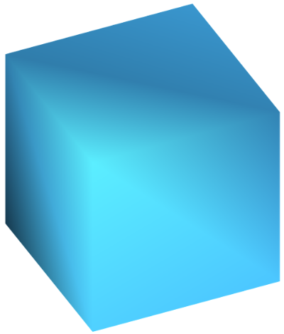
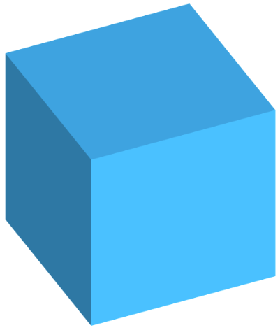
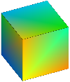

[](https://github.com/ZEISS-PiWeb/PiWeb-MeshModel/actions/workflows/dotnet.yml)
[](https://github.com/ZEISS-PiWeb/PiWeb-MeshModel/actions/workflows/dotnet.yml)

# PiWeb MeshModel

|  | The **PiWeb MeshModel library** provides an easy to use interface for reading and especially writing PiWeb meshmodel data. |
|-|:-|


# Overview

- [Introduction](#introduction)
- [Installation](#installation)
- [Usage](#usage)
- [Contributing](https://github.com/ZEISS-PiWeb/PiWeb-MeshModel/wiki/Contributing)


<a id="markdown-introduction" name="introduction"></a>
# Introduction

PiWeb meshmodel files are zip-compressed archives, containing...

* Positions
* Indices
* Normals
* Colors
* Texture coordinates
* Deviation data

To simplify and shorten the progress of writing meshmodel files, we published the meshmodel library!

<a id="markdown-installation" name="installation"></a>
# Installation

The **PiWeb MeshModel library** is available via NuGet.


## Versions >= 2.0.0

Get it at [NuGet.org](https://www.nuget.org/packages/Zeiss.PiWeb.MeshModel/).

```cmd
PM> Install-Package Zeiss.PiWeb.MeshModel
```

Or compile the library by yourself. Requirements:

* Microsoft Visual Studio 2019
* Microsoft .NET Standard 2.1


## Older versions

Get it at [NuGet.org](https://www.nuget.org/packages/Zeiss.IMT.PiWeb.MeshModel/).

```cmd
PM> Install-Package Zeiss.IMT.PiWeb.MeshModel
```

Or compile the library by yourself. Requirements:

* Microsoft Visual Studio 2015
* Microsoft .NET Framework 4.5


<a id="markdown-usage" name="usage"></a>
# Usage


<a id="markdown-1-a-simple-cube" name="1-a-simple-cube"></a>
## A simple cube

To get started, let's create a very basic shape with only a few points and a single **mesh**. Positions, as well as normals and texture coordinates, are handed into the library as plain float arrays. The only thing you actually have to specify are positions and indices; PiWeb can calculate the normals from the adjacent triangles.

```csharp
var positions = new[]
{
    new Vector3F(0.0f, 0.0f, 0.0f),
    new Vector3F(1.0f, 0.0f, 0.0f),
    new Vector3F(1.0f, 1.0f, 0.0f),
    new Vector3F(0.0f, 1.0f, 0.0f),
    new Vector3F(0.0f, 0.0f, 1.0f),
    new Vector3F(1.0f, 0.0f, 1.0f),
    new Vector3F(1.0f, 1.0f, 1.0f),
    new Vector3F(0.0f, 1.0f, 1.0f)
};

var indices = new[]
{
    0, 1, 4,    1, 5, 4,    1, 2, 5,    2, 6, 5,    2, 3, 6,    3, 7, 6,
    3, 0, 7,    0, 4, 7,    0, 1, 2,    2, 3, 0,    4, 5, 6,    6, 7, 4
};

var mesh = new Mesh( 0, positions, null, indices, null, Color.FromRgb( 71, 186, 255 ) );
var part = new MeshModelPart( new MeshModelMetadata( ), new[] { mesh } );
var model = part.ToMeshModel();

model.Serialize( outputStream );
```

When we display the model in PiWeb, the result will look like this:



This isn't very nice, because every vertex has only one normal, and it points to none of the sides, since the adjacent triangles are orthogonal to each other. You could improve this by duplicating points and specifying precalculated normals, but there's an easier way: just create a single **mesh** for **every side** of the cube:

```csharp
static Mesh CreateSquare( Vector3F p1, Vector3F p2, Vector3F p3, Vector3F p4)
{   
    return new Mesh( 0, 
        new [] { p1, p2, p3, p4 },
		null, 
        new []{ 0, 1, 2, 2, 3, 0 },
		null,
		Color.FromRgb( 71, 186, 255 ) );
}

var points = new[]
{
    new Vector3F( 0.0f, 0.0f, 0.0f ),
    // ...Seven more points
};

var meshes = new[]
{
    CreateSquare( points[ 0 ], points[ 1 ], points[ 2 ], points[ 3 ] ),
    // ...Five more squares
};

var part = new MeshModelPart( new MeshModelMetadata( ), meshes ); 
```

This will already look much better. You can improve this example further, by adding **edges**.




## Models with deviation data

PiWeb 6.2 or later can display deviations on a CAD model. To use the model with CAD deviation analysis, you must attach it to a measurement with the **RawDataService**. When creating multiple measurements
with deviation data, PiWeb offers you a set of statistical evaluations based on the data, e.g. minima, maxima, deltas or capability values. The required data is specfied like this:

```csharp
var meshes = CreateMeshes( ); // ... meshes from the previous example
var rand = new Random( DateTime.Now.Millisecond );
var meshvalues = new MeshValue[meshes.length];

// The mesh value list must have the same length as the meshes
for (var i = 0; i < meshes.Length; i++)
{
    var mesh = meshes[ i ];
    var values = new float[ mesh.Positions.Length ];
        
    // The number of values must be equal to the number of vertices  
    for (var j = 0; j < values.Length; j++ )
        values[ j ] = ( float ) ( rand.NextDouble() * 2 - 1 );

    meshvalues.Add( new MeshValue( values ) );
}

// You can either create your own scale, or use the built in ones from PiWeb.
var scale = new ColorScale( "DeviationScale", Color.FromRgb( 128, 128, 128 ), new[]
{
    new ColorScaleEntry( -1.0f, Color.FromRgb( 0 , 32, 255 ) ),
    new ColorScaleEntry( 0.0f,  Color.FromRgb( 32, 255, 0 ) ),
    new ColorScaleEntry( 1.0f, Color.FromRgb( 255, 32, 0 ) )
} );

var data = new[]
{
    new MeshValueList( meshvalues.ToArray(), new MeshValueEntry( WellKnownDataTypes.Deviation, "deviations.dat", scale ))
};

var part = new MeshModelPart( new MeshModelMetadata( ), meshes, squares.Select(s => s.Edge), data );
```

A cube isn't exactly a perfect example for showing deviations on a CAD model, but it's sufficient to show the mechanics. 


